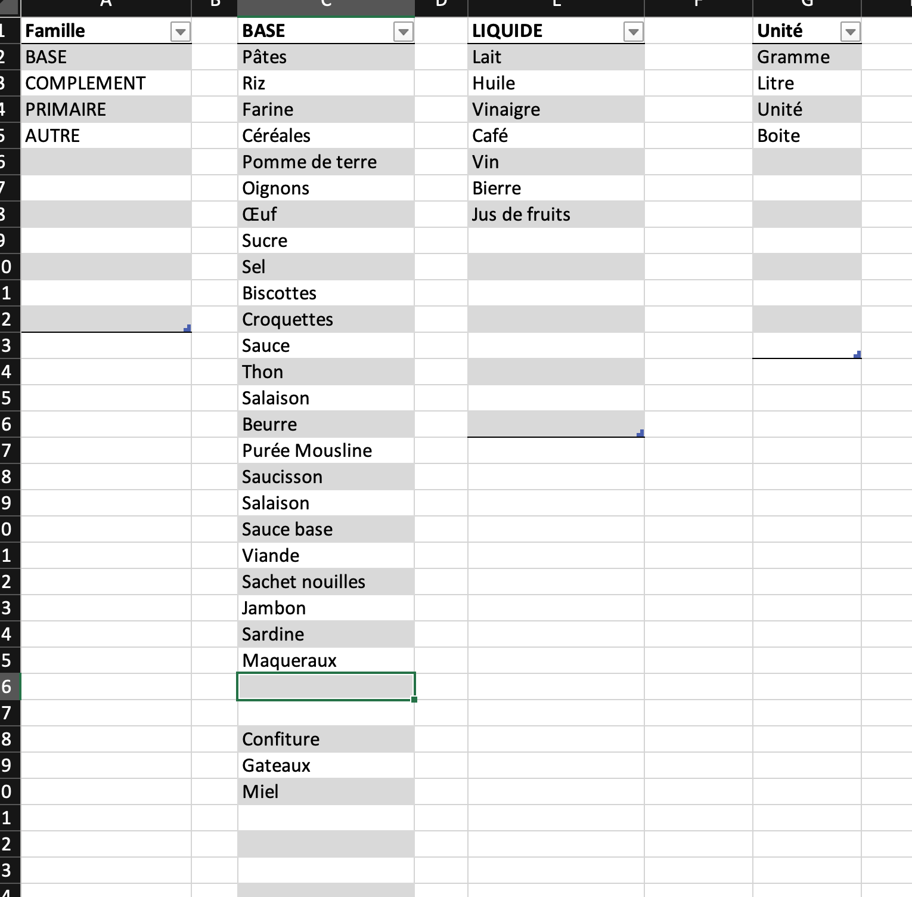

# Gestion du sotck

Classeur Excel pour gérer ses stocks de nourriture

## Utiliser le tableau

### Généralités

Le tableau comporte quatre feuilles

* **Prévisionnel**: Vue globale des réserves en jours

* **Stock**: Vue détaillée du stock et des consommations

* **Autre**: Tableau de stocks hors nourriture

* **Inventaire** Tableau pour rentrer les entrées (achats) et sorties (consommation)
 

* **Définition** Tableaux qui contiennent les type de produits, les unités etc
 

### Rentrer l'inventaire

Ouvrir la feuille **Inventaire**.  

Pour chaque grande catégorie de produit (pâtes, riz, etc) ajouter une ligne en renseignant:
* **Famille** du produit, choix entre:
    * BASE: Aliment de base (pâtes/riz/etc)
    * COMPLEMENT: Complement de base Viande, thon, etc
* **Catégorie** du produit
    * ex pâtes/thon/saucisson
* **Unité** unité du produit
    * Gramme / Litre 
* **Qté / Paquet** la quantité par paquet/boite/etc
    * Exemple: 200g de thon / 500 grammes de pâtes
* **Nombre de paquets** le nombre de paquets
* **Mouvement** renseigner 
    * Entrée: Pour un achat
    * Sortie: Pour une consommation
* **Date** la date

La feuille calculera ainsi le **total** dans la colonne du même nom.

> Il est primordial de bien renseigner cette feuille car c'est la base de tous les calculs.  
* Lors de l'inventaire initial
* Après avoir fait ses courses
* Après avoir consommé un paquet de pâtes, une boite de thon, d'oeufs etc.
> Les colonnes **Famille**, **Catégorie**, **Unité** et **Mouvement** sont des listes de choix basées sur les tableaux dans la feuille **Définition**.  
Si un produit n'est pas disponible dans la liste de choix, il faut le rajouter dans le feuille **Définition** avant de le choisir dans le feuille **Inventaire**

**Exemple de lignes d'inventaire**

> Rappel, 1kg = 1000 grammes et 1L = 1000mL

Dans les 3 premières lignes nous avons rentré en stock.
* Ligne 2: 2 paquets de pâtes de 250g le 15 mars
* Ligne 3: 4 paquet de 1kg de croquettes le 15 mars
* Ligne 4: 1 paquet de 1Kg de riz le 15 mars

Dans la ligne suivante nous avons consommé

* Ligne 5: 1 paquet de croquette de 1kg le 15 mars

### Gérer le stock

Dans la feuille stock nous définissons:

* **Catégorie** du produit
    * ex pâtes/thon/saucisson
* **Unité** unité du produit
    * Gramme / Litre 
* **Objectif** du stock pour le produit
* **Cons/Repas** la consommation moyenne par repas du produit si cela a un sens, par exemple pâtes: 150g/repas/personnes
* **Cons/Jour** la consommation par jour si la consommation par repas n'a pas de sens, par exemple 0,2l (200ml) de lait/jour/personnes

Les colonnes calculées donnent:

* **Inventaire** La quantité réelle en stock (d'après les lignes d'inventaire)
* **Besoin** La quantité manquante pour atteindre l'objectif
* **Réserve réelle** Le nombre de jours disponibles/personne
* **Réserve besoin** La réserve si l'objectif est atteint

**Exemple** de lignes de stock

### Consulter le prévisionnel

Dans la feuille prévisionnel nous devons définir:
* Le nombre de personnes du foyer
* Le nombre d'animaux (consommateurs de croquettes)
* Le nombre de repas/jour

Le tableau prévisionnel donne les éléments suivants donne le nombre de jours restant pour un produit et pour toute la famille de produits.  
La colonne **Force consommateur** permet de rentrer une valeur différente que celle définie globalement par **Nombre de personnes**.

**Exemple** de prévisionnel

